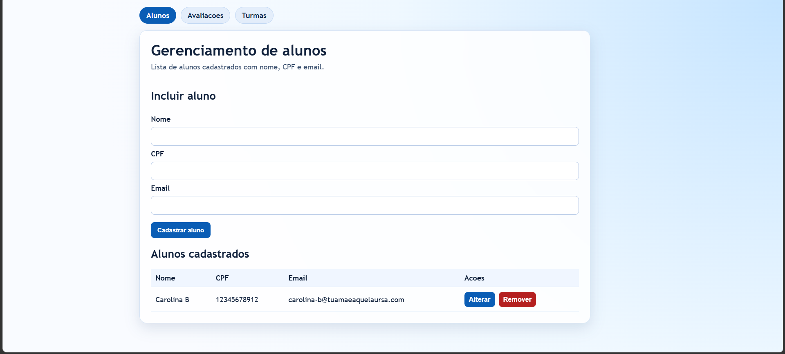
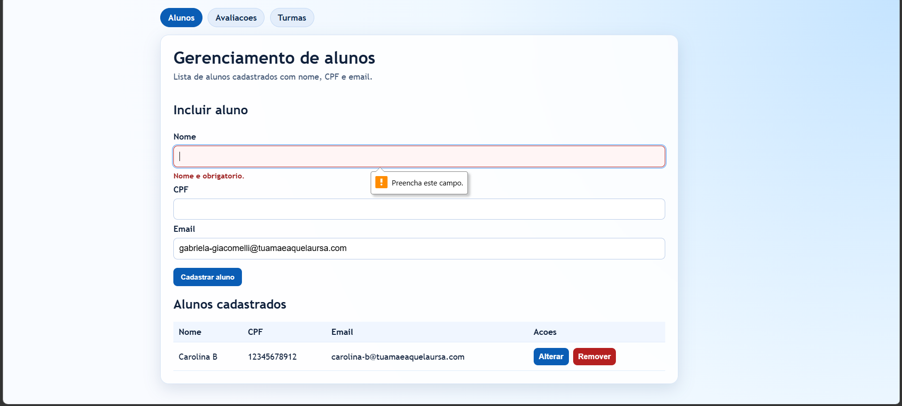
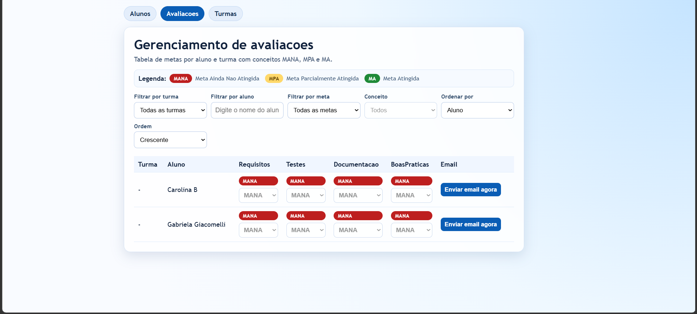
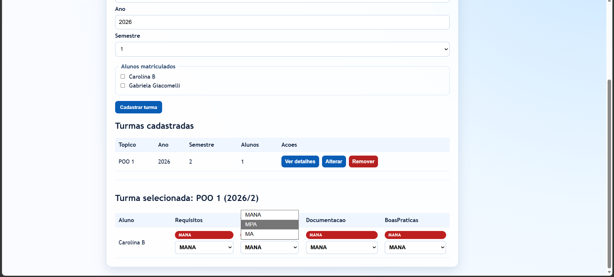
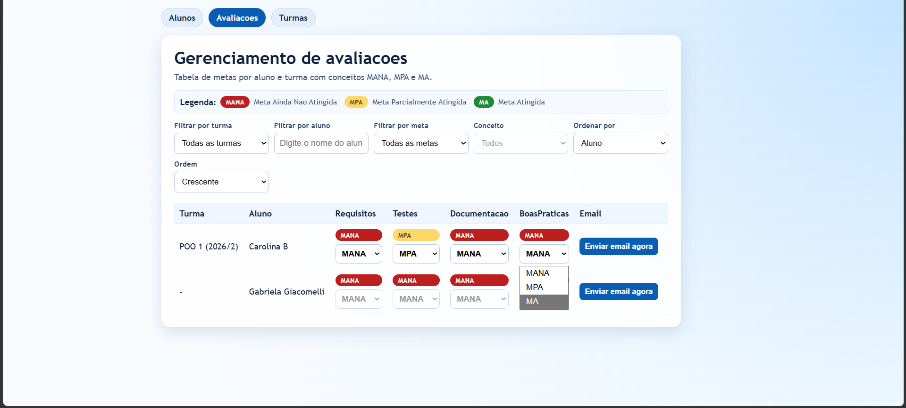
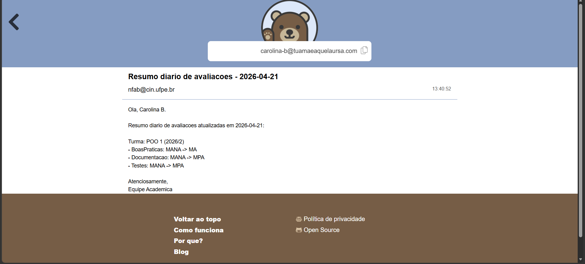

# proftest2

Sistema web inicial para gerenciamento de alunos e avaliacoes.

## Screenshots

| | |
|:---:|:---:|
|  |  |
|  |  |
|  |  |

## Stack obrigatoria

- Cliente: React + TypeScript
- Servidor: Node.js + TypeScript
- Testes de aceitacao: Cucumber + Gherkin
- Execucao: somente via Docker Compose

## Funcionalidade inicial entregue

Gerenciamento de alunos com:

- inclusao de aluno
- alteracao de aluno
- remocao de aluno
- pagina especifica com listagem de alunos cadastrados

Gerenciamento de avaliacoes em pagina separada com:

- tabela por aluno e metas
- colunas de metas (Requisitos, Testes, Documentacao, BoasPraticas)
- conceitos MANA, MPA e MA por meta
- alteracao de avaliacao por aluno/meta
- legenda visual dos conceitos (MANA vermelho, MPA amarelo, MA verde)
- filtro por aluno e por meta/conceito
- ordenacao por aluno ou por meta (crescente/decrescente)
- notificacao diaria por email para cada aluno com consolidacao das alteracoes de avaliacao

Gerenciamento de turmas com:

- inclusao, alteracao e remocao de turmas
- topico, ano e semestre por turma
- alunos matriculados por turma
- avaliacoes por aluno dentro de cada turma
- visualizacao separada de cada turma com sua propria tabela de alunos e conceitos

Cada aluno possui os campos:

- nome
- CPF
- email

## Estrutura de pastas

- sistema/server: API REST em Node.js + TypeScript
- sistema/client: interface React + TypeScript
- sistema/tests: testes de aceitacao com Cucumber

## Como executar em desenvolvimento

Subir cliente e servidor:

```bash
docker compose -f sistema/docker-compose.yml up --build
```

Aplicacao cliente: http://localhost:3000  
API servidor: http://localhost:3001

## Build via Docker

Build do servidor:

```bash
docker compose -f sistema/docker-compose.yml run --rm server npm run build
```

Build do cliente:

```bash
docker compose -f sistema/docker-compose.yml run --rm client npm run build
```

## Testes de aceitacao via Docker

```bash
docker compose -f sistema/docker-compose.yml run --rm tests npm test
```

Os testes usam um servico dedicado (`server-tests`) com diretório de dados isolado em volume Docker.
Assim, os arquivos `sistema/server/data/students.json` e `sistema/server/data/classes.json` nao sao alterados durante a execucao dos testes.

## API de alunos

Base URL: http://localhost:3001

- GET /health: status da API
- GET /students: lista todos os alunos
- POST /students: cria um aluno
- PUT /students/:id: altera um aluno
- DELETE /students/:id: remove um aluno

## API de avaliacoes

- GET /assessments: retorna matriz de avaliacoes (metas, conceitos e linhas por aluno)
- PUT /assessments/:studentId: atualiza as avaliacoes do aluno informado

## API de turmas

- GET /classrooms: lista turmas com alunos e avaliacoes da turma
- GET /classrooms/:id: detalha uma turma especifica
- POST /classrooms: cria uma turma
- PUT /classrooms/:id: altera uma turma
- DELETE /classrooms/:id: remove uma turma
- PUT /classrooms/:id/evaluations/:studentId: atualiza avaliacao do aluno na turma

## Notificacoes de avaliacao por email

- Cada alteracao de avaliacao entra em uma fila diaria por aluno.
- E enviado no maximo 1 email por aluno por dia, com todas as metas alteradas no dia.
- O resumo pode incluir alteracoes de varias turmas no mesmo email.
- A tela de avaliacoes possui botao para forcar envio imediato do digest do aluno.
- O envio usa Nodemailer com Gmail SMTP e registra historico em arquivo JSON.

Endpoints de notificacao:

- POST /notifications/force-send/:studentId: forca envio imediato dos digests pendentes do aluno
- GET /notifications/sent/:studentId: consulta historico de digests enviados para o aluno

Arquivos de notificacao no diretório de dados do servidor (`DATA_DIR`):

- `pending-digests.json`: fila de digests pendentes
- `sent-digests.json`: historico de emails enviados

Variaveis de ambiente do servidor:

- `DATA_DIR`: diretório base dos arquivos JSON (default: `./data`)
- `DIGEST_DISPATCH_INTERVAL_MS`: intervalo de verificacao da fila de digests (default: `60000`)
- `SMTP_USER`: email da conta Gmail usada para envio
- `SMTP_PASS`: App Password da conta Gmail
- `SMTP_FROM`: remetente exibido no email (opcional, usa `SMTP_USER` se vazio)

Configuracao de SMTP:

- Preencha o arquivo `sistema/server/.env` com `SMTP_USER` e `SMTP_PASS`.
- O arquivo modelo esta em `sistema/server/.env.example`.
- Para testes automatizados, o servico `server-tests` usa `SMTP_MOCK=true` no Docker Compose para nao depender de credenciais reais.

### Exemplo de payload para criar/alterar turma

```json
{
	"topic": "Introducao a Programacao",
	"year": 2026,
	"semester": 1,
	"studentIds": ["id-do-aluno-1", "id-do-aluno-2"]
}
```

### Exemplo de payload para atualizar avaliacao

```json
{
	"evaluations": {
		"Requisitos": "MPA",
		"Testes": "MA",
		"Documentacao": "MANA",
		"BoasPraticas": "MPA"
	}
}
```

### Exemplo de payload

```json
{
	"name": "Ana Silva",
	"cpf": "12345678901",
	"email": "ana@escola.com"
}
```

## Validacoes iniciais implementadas

- nome com no minimo 3 caracteres
- CPF com 11 digitos numericos
- email valido
- CPF unico
- email unico

## Feedback visual na interface

- avisos de campo obrigatorio por campo (nome, CPF e email)
- indicacao visual de campo invalido no formulario
- aviso explicito quando o usuario tenta informar letras/simbolos no CPF
- confirmacao antes de remover aluno
- notificacoes em toast para sucesso, erro e avisos de envio

## Paginas da interface

- /alunos: gerenciamento de cadastro de alunos
- /avaliacoes: gerenciamento das avaliacoes por metas
- /turmas: gerenciamento de turmas com alunos matriculados e avaliacoes por turma

## Cenarios de aceitacao (Gherkin)

Arquivo: sistema/tests/src/features/gerenciamento-alunos.feature

- cadastrar e listar aluno
- alterar aluno existente
- remover aluno existente
- rejeitar cadastro com email invalido
- rejeitar cadastro com CPF duplicado

Arquivo: sistema/tests/src/features/gerenciamento-avaliacoes.feature

- listar matriz de avaliacoes por aluno
- atualizar avaliacao por meta
- rejeitar conceito invalido na avaliacao
- forcar envio de email com consolidacao de multiplas metas no dia
- forcar envio de email consolidando alteracoes em turmas diferentes
- forcar envio sem alteracoes pendentes

Arquivo: sistema/tests/src/features/gerenciamento-turmas.feature

- cadastrar e consultar turma com alunos matriculados
- alterar dados de turma
- remover turma
- atualizar avaliacao de aluno dentro da turma
- rejeitar turma com aluno inexistente
